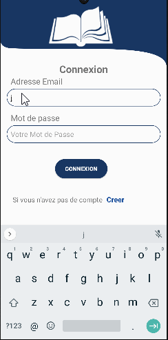

# TCHALAM

## Table of Contents
1. [Overview](#Overview)
1. [Product Spec](#Product-Spec)
1. [Wireframes](#Wireframes)
1. [Schema](#Schema)

## Overview
### Description
TCHALAM is a preparation application for graduating students to better address university admission exams (Public, Private).

### App Evaluation
- **Category:** Educatif
- **Mobile:** This application is mainly developed for mobiles in order to properly address the exams for university admission
- **Story:** TCHALAM is an online prefact application where all graduating students can prepare quizzes for the university admission exam.
- **Market:** All graduating students who intend to integrate public and private universities can use the application
- **Habit:** This application can be used as often or rarely as the user wishes depending on subject to be prepared.
- **Scope:** The Tchalam application has an educational scope since it is a tool for graduating students  to integrate universities.

## Product Spec

### 1. User Stories (Required and Optional)

**Required Must-have Stories**
- [x] User can Register a new Account
- [x] User can Login
- [x] The user can choose a subject to prepare.
- [x] The user can take quizzes for a subject
- [x] Profile

**Optional Nice-to-have Stories**

- [ ] Advanced Quiz
- [ ] Score Sharing

### 2. Screen Archetypes

* Login
   * User can login
* Register
   * User can register a new account
* Stream
    * user can see the list of exam subjects
* Choose Subject
    * User can choose a exam subject
* Quiz
    * User can answer quizzes for an exam subject
* Profile
    * User can see their progress on an exam topic

### 3. Navigation

**Tab Navigation** (Tab to Screen)

* Stream
* Profile
* Quiz

**Flow Navigation** (Screen to Screen)

* Login
   * Stream
* Register
   * Stream
* Stream
    * Detail
* Choose Subject
    * Stream
* Quiz
    * Quiz
* Profile
    * Detail

## Wireframes

### [BONUS] Digital Wireframes & Mockups

### [BONUS] Interactive Prototype

## Schema 

### Models
Model: User

| Property  | Type     | Description                               		|
| --------- | -------- | ---------------------------------------------- |
| ObjectId  | String   | Unique id for User account                		|
| createdAt | Datetime | date when post is created (default field)     	|
| updatedAt | Datetime | date when post is last updated (default field)	|
| lastname  | String   | name of the user                          		|
| firstname | String   | first name of the user                    		|
| email     | String   | email of the user                         		|
| password  | String   | Password of the user                      		|

Model: Subject

| Property  | Type     | Description                           			|
| --------  | -------- | ---------------------------------------------- |
| ObjectId  | String   | Unique id for subject                 			|
| createdAt | Datetime | date when post is created (default field)     	|
| updatedAt | Datetime | date when post is last updated (default field)	|
| Name      | String   | Name of the subject                   			|
| subject   | String   | Subject 							   			| 

Model: Quiz

| Property  | Type     | Description                                    |
| --------- | -------- | ---------------------------------------------- |
| ObjectId  | String   | Unique id for Quiz                             |
| createdAt | Datetime | date when post is created (default field)      |
| updatedAt | Datetime | date when post is last updated (default field) |
| quiz  | String   | quiz about a subject                       |
| A         | String   | option answer 1                                |
| B         | String   | option answer 2                                |
| C         | String   | option answer 3                                |
| D         | String   | option answer 4                                |
| answer    | Int      | number of the Correct Answer                   |
| subject   | Pointer  | Pointer to Subject                             |

Model: Answer

| Property  | Type     | Description                          			 |
| --------  | -------- | ----------------------------------------------- |
| ObjectId  | String   | Unique id for Answer            	   			 |
| createdAt | Datetime | date when post is created (default field)     	 |
| updatedAt | Datetime | date when post is last updated (default field)  |
| quiz	    | Pointer  | Pointer to Quiz					   			 |
| user      | Pointer  | Pointer to User 					             |
| score 	| Int	   | Score for a quiz					             |

### Networking
- Login Screen
	- (Read/GET) Query logged in user object
- Profile Screen
	- Read/GET) Query that displays the profile of the user on the application.
- Sign in Screen
	- (Create/POST) Create a new user object
	- (Read/GET) Query that checks if entered email already exists in database.
- Home Screen
	- (Read/GET) Query get list Subject
- Quiz Screen
	- (Read/GET) Query get list quiz for a Subject
	- (Create/POST) Answer for a quiz 
	
## Video Walkthrough

Here's a walkthrough of implemented user stories:
	

